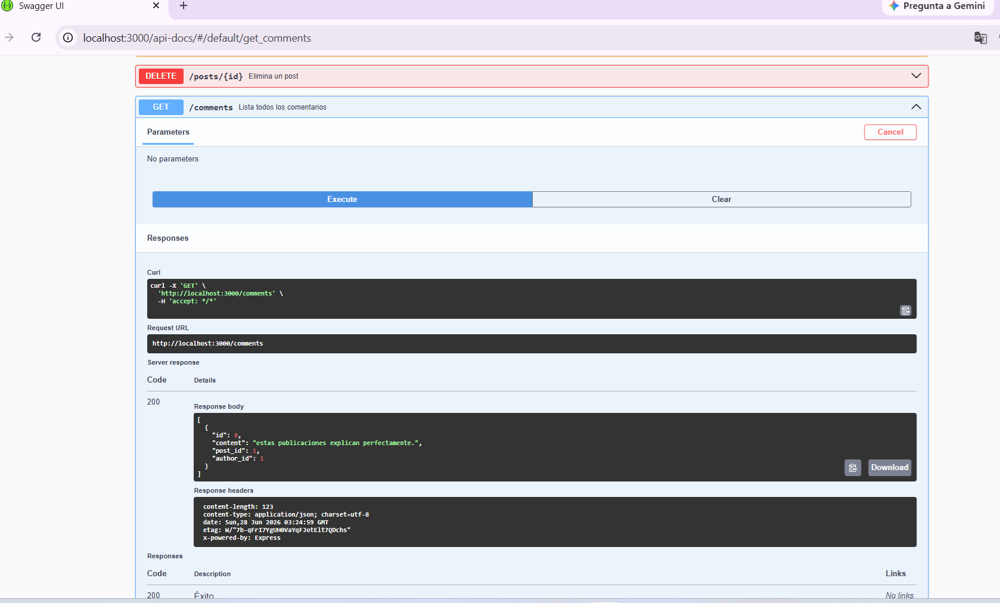
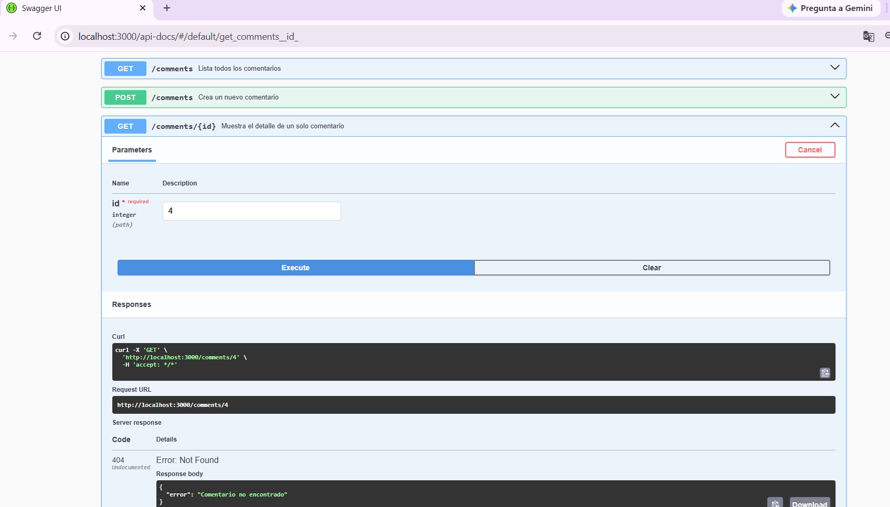
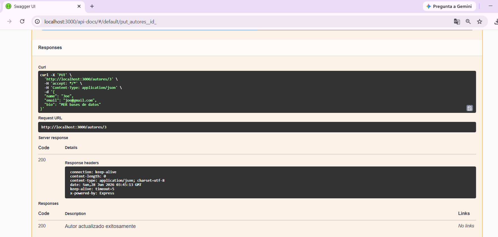
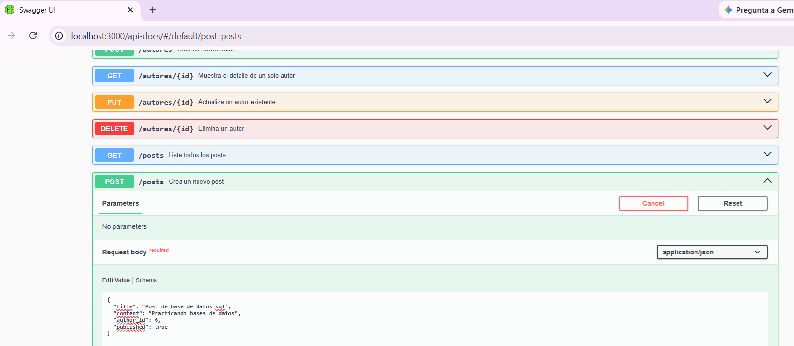

# Proyecto Integrador Api Rest DevSpark

# Documentación - 📔MiniBlog API

## 🌟 Tabla de Contenidos

1. 📖 Descripción General
2. 🛠️ Tecnologías y Herramientas
3. 🌳 Estructura del Proyecto
4. 📁 Explicación de Carpetas
5. 📄 Explicación de Archivos
6. 🚀 Instalación y Configuración
7. ▶️ Ejecución y Pruebas
8. 📚 Documentación Swagger
   📸 Captura de Swagger
9. ☁️ Despliegue en Railway
10. 🤖 Uso de IA

## 1. 📖 Descripción general

Miniblog API REST es una aplicación backend desarrollada con Node.js, Express y PostgreSQL para almacenamiento de información.

API RESTful para la gestión de un blog, permitiendo el control de autores, publicaciones y comentarios.

## 2. 🛠️ Tecnologías y Herramientas

- **Node.js**: Entorno de ejecución para JavaScript.
- **Express**: Framework web para la creación de las rutas de la API.
- **PostgreSQL**: Sistema de gestión de bases de datos relacional.
- **Swagger (OpenAPI)**: Interfaz gráfica para documentación y pruebas de endpoints.

## 3. 🌳Estructura del proyecto

📁 Miniblog
├── db/    
│   ├── index.js               # Configuración de Express
│   ├── seed.js                # Usuario de pruebas
│   └── setup                  # Creación de tablas
├── docs/                      # documentación para el README.md
    └── imagenes/              # imagenes para el README.md                    
├── node_modules               # Instalación dependencias
├── src/                       # Código de fuente principal
│   ├── controllers/           # Lógica de las rutas
│   ├── routes/                # Definición de rutas
│   └── app.js/                # Lógica de negocio
├── tests/                     # Pruebas automatizadas
└── test-db.js                 # Configuración de pruebas
├── .env                       # Valiables de entorno 
├── .env.example    # Valiables de entorno que necesita el proyecto
├── .gitignore     # Carpetas que no se deben subir al GitHub
├── openapi.yaml               # Manual técnico
├── package-lock.json  #registro de versiones exactas de dependencias         
├── package.json               # Dependencias y scripts
└── README.md                  # Información general

## 4. 📁 Explicación de Carpetas

📁 db/- Contiene archivos relacionados con conexión y exportación

📁 docs/imagenes - imagenes para el README.md 

📂 src/- Código de fuente principal. Define URLs y qué métodos HTTP (GET, POST, PUT, DELETE) acepta.

📂 tests/- Pruebas automatizadas con supertest

## 5. 📄 Explicación de archivos

📁 db/index.js - Lee las variables de entorno, crea la     conexión con postgresql y la exporta para su utilización.

 🌱 seed.sql - Creación de autores, posts y comentarios con datos ficticios para realizar pruebas.

🏗️ setup.sql - Creación de las tablas 

📂 src/controllers - Lógica de negocios y consultas SQL.

🕹️ authorsController.js - Gestiona usuarios/autores
🕹️ commentsController.js - Gestiona comentarios
🕹️ postsController.js - Gestiona posts/artículos

📂 src/routes - Definición de las rutas del servidor

🔀 authorsRoutes.js - Gestiona rutas de usuarios/autores
🔀 commentsRoutes.js - Gestiona las rutas de comentarios
🔀 postsRoutes.js - Gestiona las rutas de publicaciones: posts/artículos.

📄 app.js - Crea, configura el servidor e inicializa los módulos.

📂 tests/authors.test.js - Contiene las pruebas de los endpoints de autores

🧪 comments.test.js - Contiene las pruebas de los endpoints de comments

🧪 posts.test.js - Contiene las pruebas de los endpoints de posts

🧪 test-db.js - Verifica la conexión con la base de datos PostgreSQL

🔐 .env - Variables de entorno o información protegida
 
🌱 .en.example - Plantilla con las variables de entorno necesarias para configurar el proyecto.

🚫 .gitignore - Excluye o protege archivos.

📖 openapi.yaml - Archivo de especificación de la documentación

🔐 package-lock.json - Bloquea o fija las versiones de las dependencias.

📦 package.js - Paquete del proyecto y sus dependencias.

📄 README.md - Documentación o guía del proyecto

## 6. 🚀 Instalación y Configuración

1. **Clonar el proyecto:** Descarga los archivos en tu máquina local.
2. **Instalar dependencias:** Abre la terminal en la raíz del proyecto y ejecuta: _npm install_
3. **Variables de Entorno:** Crea un archivo llamado .env en la raíz y define los datos de tu base de datos:

DB_USER=tu_usuario
DB_PASSWORD=tu_contraseña
DB_HOST=localhost
DB_PORT=5432
DB_NAME=miniblog_db

## 7. ▶️ Ejecución y Pruebas

**Modo de desarrollo:** Para encender el servidor y que se reinicie automáticamente al guardar cambios, ejecuta: _npm run dev_

Interactuar con la API: No necesitas Postman. Con el servidor encendido, abre tu navegador e ingresa a la documentación interactiva:
👉 http://localhost:3000/api-docs

Tests: npm run test

## 8. 📚 Documentación Swagger
    📸 Captura Swagger

### Obtener todos los comments:

  

### Obtener un comments por ID:

  

### Actualizar autores por ID:

  

### Crear un posts:

  

# 9. ☁️ Despliegue en Railway

Configura las Variables de Entorno (DB_USER, DB_PASSWORD, etc.) en el panel de control de tu servicio en Railway y vincula tu repositorio. Railway detectará automáticamente el despliegue.

# 10. 🤖 Uso de IA

Este proyecto fue desarrollado con asistencia de IA (Gemini y chatgpt) para el diseño de la arquitectura de la API, definición del esquema de base de datos, lógica de controladores y depuración técnica.
